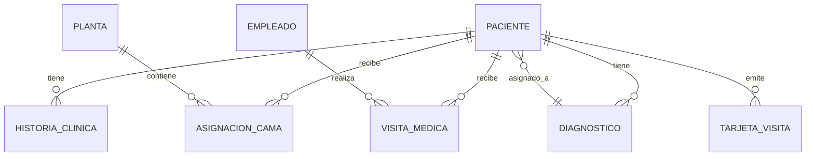
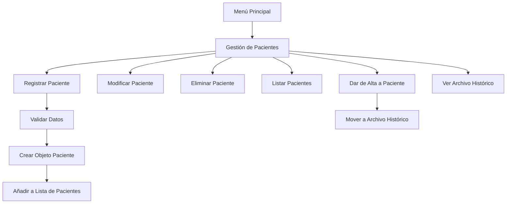
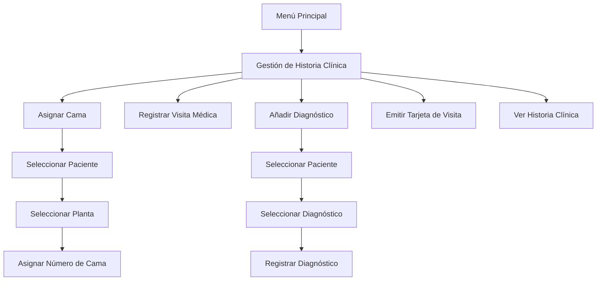

# Documentación del Sistema de Gestión Hospitalaria

Este documento proporciona una explicación detallada de cada componente del sistema de gestión hospitalaria, diseñado para administrar pacientes, médicos, diagnósticos, plantas hospitalarias e historias clínicas.

## Índice

1. [Introducción](#introducción)
2. [Estructura del Proyecto](#estructura-del-proyecto)
3. [Archivo Principal](#archivo-principal-appjs)
4. [Modelos de Datos](#modelos)
5. [Controladores](#controladores)
6. [Flujos de Trabajo](#flujos-de-trabajo)
7. [Guía de Usuario](#guía-de-usuario)

## Introducción

El Sistema de Gestión Hospitalaria es una aplicación de consola desarrollada en JavaScript (Node.js) que permite gestionar las operaciones básicas de un hospital, incluyendo:

- Registro y seguimiento de pacientes
- Gestión de personal médico
- Administración de diagnósticos
- Control de plantas hospitalarias y asignación de camas
- Manejo de historias clínicas, visitas médicas y tarjetas de visita

El sistema utiliza estructuras de datos en memoria para almacenar la información durante la ejecución del programa, con una interfaz por consola que facilita la interacción con el usuario.

### Requisitos del Sistema

- Node.js (versión 12.0 o superior)
- NPM (Node Package Manager)
- Biblioteca readline-sync

### Instalación

1. Clone o descargue el repositorio del proyecto
2. Abra una terminal en el directorio del proyecto
3. Instale las dependencias necesarias:

```bash
npm install
```

4. Ejecute la aplicación:

```bash
node app.js
```

## Estructura del Proyecto

El proyecto está organizado en los siguientes directorios:

- **controllers/**: Contiene la lógica de negocio y manejo de datos para cada entidad del sistema
  - `pacienteController.js`: Gestión de pacientes
  - `empleadoController.js`: Gestión de médicos
  - `diagnosticoController.js`: Gestión de diagnósticos
  - `historiaClinicaController.js`: Gestión de historias clínicas
  - `plantaController.js`: Gestión de plantas hospitalarias

- **models/**: Define las estructuras de datos utilizadas en la aplicación
  - `Paciente.js`: Modelo de datos para pacientes
  - `Empleado.js`: Modelo de datos para médicos
  - `Diagnostico.js`: Modelo de datos para diagnósticos
  - `HistoriaClinica.js`: Modelo de datos para historias clínicas
  - `Planta.js`: Modelo de datos para plantas hospitalarias

- **views/**: Contiene archivos para la presentación (actualmente no implementados)

- **utils/**: Contiene utilidades para el proyecto

## Archivo Principal (app.js)

```javascript
// Importa la biblioteca readline-sync para interacción por consola
const readlineSync = require('readline-sync');

// Importa los controladores de cada módulo del sistema
const pacienteController = require('./controllers/pacienteController');
const empleadoController = require('./controllers/empleadoController');
const diagnosticoController = require('./controllers/diagnosticoController');
const historiaClinicaController = require('./controllers/historiaClinicaController');
const plantaController = require('./controllers/plantaController');

// Función que muestra el menú principal del sistema
function mostrarMenuPrincipal() {
    // Muestra el título y opciones disponibles
    console.log('\n==============================');
    console.log('  SISTEMA DE GESTIÓN HOSPITALARIA');
    console.log('==============================');
    console.log('1. Pacientes');
    console.log('2. Médicos');
    console.log('3. Diagnósticos');
    console.log('4. Plantas del Hospital');
    console.log('5. Historia Clínica');
    console.log('6. Salir');
}

// Función principal que inicia la aplicación
function main() {
    let opcion = '';
    // Bucle principal del programa
    do {
        // Muestra el menú y solicita una opción al usuario
        mostrarMenuPrincipal();
        opcion = readlineSync.question('Seleccione una opcion: ');
        
        // Procesa la opción seleccionada
        switch (opcion) {
        case '1': // Gestión de pacientes
            pacienteController.mostrarMenuPacientes();
            break;
        case '2': // Gestión de médicos
            empleadoController.mostrarMenuEmpleados();
            break;
        case '3': // Gestión de diagnósticos
            diagnosticoController.mostrarMenuDiagnosticos();
            break;
        case '4': // Gestión de plantas hospitalarias
            plantaController.mostrarMenuPlantas();
            break;
        case '5': // Gestión de historias clínicas
            historiaClinicaController.mostrarMenuHistorias();
            break;
        case '6': // Salir del sistema
            console.log('Saliendo del sistema...');
            break;
        default: // Opción inválida
            console.log('Opcion no válida.');
        }
    } while (opcion !== '6'); // Continúa hasta que el usuario elija salir
}

// Inicia la aplicación
main();
```

## Modelos

### Relaciones entre Entidades

El sistema está diseñado con las siguientes relaciones entre entidades:



### Paciente (models/Paciente.js)

La clase `Paciente` representa a una persona que recibe atención médica en el hospital.

**Propiedades principales:**
- `id`: Identificador único del paciente
- `numeroDocumento`: Número de documento de identidad
- `numeroHistoria`: Número de historia clínica
- `nombre` y `apellidos`: Datos personales
- `direccion` y `telefono`: Datos de contacto
- `fechaNacimiento`: Fecha de nacimiento
- `fechaRegistro`: Fecha de ingreso al sistema

**Propiedades relacionales:**
- `asignacionesCama`: Registro de asignaciones de cama
- `tarjetasVisita`: Tarjetas emitidas para visitantes (máximo 4)
- `visitasMedicas`: Registro de visitas médicas recibidas
- `diagnosticos`: Lista de diagnósticos asignados

```javascript
// Define la clase Paciente que representa a un paciente en el sistema
class Paciente {
    // Constructor que inicializa un nuevo paciente con sus datos
    constructor(
        id,                  // Identificador único del paciente
        numeroDocumento,      // Número de documento de identidad
        numeroHistoria,       // Número de historia clínica
        nombre,               // Nombre del paciente
        apellidos,            // Apellidos del paciente
        direccion,            // Dirección del paciente
        telefono,             // Teléfono de contacto
        fechaNacimiento,      // Fecha de nacimiento
        fechaRegistro = new Date() // Fecha de registro (por defecto es la fecha actual)
    ) {
        // Asigna los valores recibidos a las propiedades del objeto
        this.id = id;
        this.numeroDocumento = numeroDocumento;
        this.numeroHistoria = numeroHistoria;
        this.nombre = nombre;
        this.apellidos = apellidos;
        this.direccion = direccion;
        this.telefono = telefono;
        this.fechaNacimiento = fechaNacimiento;
        this.fechaRegistro = fechaRegistro;

        // Inicializa arreglos para almacenar información adicional del paciente
        this.asignacionesCama = [];  // Registro de asignaciones de cama: { planta, nombrePlanta, numeroCama, fechaAsignacion }
        this.tarjetasVisita = [];    // Tarjetas de visita (máximo 4): { numeroTarjeta, horaInicio, horaFin, entregadoA }
        this.visitasMedicas = [];    // Registro de visitas médicas: { fecha, hora, medico }
        this.diagnosticos = [];      // Diagnósticos del paciente: { codigo, descripcion, fechaDiagnostico }
    }
}

// Exporta la clase para usarla en otros archivos
module.exports = Paciente;
```

### Empleado (models/Empleado.js)

La clase `Empleado` representa al personal médico del hospital, principalmente médicos.

**Propiedades:**
- `id`: Código único del empleado
- `nombre`: Nombre completo del empleado
- `cargo`: Puesto que ocupa (por defecto "Médico")

```javascript
// Define la clase Empleado que representa a un empleado (médico) en el sistema
class Empleado {
    // Constructor que inicializa un nuevo empleado con sus datos
    constructor(id, nombre, cargo) {
        this.id = id;         // Identificador único del empleado
        this.nombre = nombre; // Nombre completo del empleado
        this.cargo = cargo;   // Cargo del empleado (por defecto "Médico")
    }
}

// Exporta la clase para usarla en otros archivos
module.exports = Empleado;
```

### Diagnóstico (models/Diagnostico.js)

La clase `Diagnostico` representa una condición médica que puede ser asignada a un paciente.

**Propiedades:**
- `id`: Código único del diagnóstico
- `descripcion`: Descripción detallada del diagnóstico

```javascript
// Define la clase Diagnostico que representa un diagnóstico médico en el sistema
class Diagnostico {
    // Constructor que inicializa un nuevo diagnóstico con sus datos
    constructor(id, descripcion) {
        this.id = id;                 // Código único del diagnóstico
        this.descripcion = descripcion; // Descripción del diagnóstico
    }
}

// Exporta la clase para usarla en otros archivos
module.exports = Diagnostico;
```

### Historia Clínica (models/HistoriaClinica.js)

La clase `HistoriaClinica` representa el registro médico completo de un paciente.

**Propiedades:**
- `id`: Identificador único de la historia
- `pacienteId`: ID del paciente al que pertenece
- `tratamientos`: Lista de tratamientos aplicados

```javascript
// Define la clase HistoriaClinica que representa la historia clínica de un paciente
class HistoriaClinica {
    // Constructor que inicializa una nueva historia clínica
    constructor(id, pacienteId, tratamientos = []) {
        this.id = id;                   // Identificador único de la historia
        this.pacienteId = pacienteId;    // ID del paciente al que pertenece
        this.tratamientos = tratamientos; // Lista de tratamientos (inicialmente vacía)
    }
}

// Exporta la clase para usarla en otros archivos
module.exports = HistoriaClinica;
```

### Planta (models/Planta.js)

La clase `Planta` representa un piso o sección del hospital con un número determinado de camas.

**Propiedades:**
- `id`: Número de la planta
- `nombre`: Nombre o especialidad de la planta
- `numeroCamas`: Cantidad total de camas disponibles

```javascript
// Define la clase Planta que representa una planta o piso del hospital
class Planta {
    // Constructor que inicializa una nueva planta con sus datos
    constructor(id, nombre, numeroCamas) {
        this.id = id;                   // Número de la planta (ej: 1, 2, 3)
        this.nombre = nombre;            // Nombre de la planta (ej: "Cardiología")
        this.numeroCamas = numeroCamas;  // Número total de camas disponibles
    }
}

// Exporta la clase para usarla en otros archivos
module.exports = Planta;
```

## Controladores

### Funciones de Validación Comunes

Todos los controladores implementan funciones de validación similares para garantizar la integridad de los datos:

- `validarCampo`: Verifica que un campo no esté vacío o contenga solo espacios
- `validarNumero`: Asegura que un campo sea un número válido y no negativo
- `validarFecha`: Comprueba que una fecha tenga formato correcto (YYYY-MM-DD) y no sea futura

Estas validaciones se aplican consistentemente en todos los formularios de entrada de datos.

### Paciente Controller (controllers/pacienteController.js)

El controlador de pacientes gestiona todas las operaciones relacionadas con los pacientes del hospital.

```javascript
// Importa la biblioteca readline-sync para interacción por consola
const readlineSync = require("readline-sync");
// Importa el modelo Paciente
const Paciente = require("../models/Paciente");

// Arreglos para almacenar los datos en memoria
let pacientes = [];             // Lista de pacientes activos
let pacientesHistoricos = [];   // Archivo histórico de pacientes dados de alta

// Función para validar que un campo no esté vacío
function validarCampo(mensaje, campo) {
    let valor;
    // Bucle que se repite hasta que el usuario ingrese un valor válido
    do {
        // Solicita el valor al usuario
        valor = readlineSync.question(mensaje).trim();
        // Verifica si el valor está vacío o solo contiene espacios
        if (valor === "" || /^\s+$/.test(valor)) {
            console.log(`Error: El campo "${campo}" no puede estar vacio ni contener solo espacios.`);
        }
    } while (valor === "" || /^\s+$/.test(valor));
    return valor; // Retorna el valor validado
}

// Función para validar que un campo sea un número válido
function validarNumero(mensaje, campo) {
    let valor;
    // Bucle que se repite hasta que el usuario ingrese un número válido
    do {
        // Solicita el valor al usuario
        valor = readlineSync.question(mensaje).trim();
        // Verifica si el valor está vacío
        if (valor === "" || /^\s+$/.test(valor)) {
            console.log(`Error: El campo "${campo}" no puede estar vacio.`);
            valor = null;
        } 
        // Verifica si el valor no es un número
        else if (isNaN(valor)) {
            console.log(`Error: El campo "${campo}" debe ser un numero valido.`);
            valor = null;
        } 
        // Verifica si el valor es negativo
        else if (Number(valor) < 0) {
            console.log(`Error: El campo "${campo}" no puede ser negativo.`);
            valor = null;
        }
    } while (valor === null);
    return valor; // Retorna el valor validado
}

// Función para validar que una fecha tenga formato correcto y no sea futura
function validarFecha(mensaje) {
    let fechaValida = false;
    let fecha;
    // Bucle que se repite hasta que el usuario ingrese una fecha válida
    while (!fechaValida) {
        // Solicita la fecha al usuario
        let input = readlineSync.question(mensaje).trim();
        fecha = new Date(input);
        // Verifica si la fecha es válida y tiene el formato correcto
        if (!isNaN(fecha.getTime()) && input.match(/^\d{4}-\d{2}-\d{2}$/)) {
            // Verifica si la fecha es futura
            if (fecha > new Date()) {
                console.log("Error: La fecha no puede ser en el futuro.");
            } else {
                fechaValida = true;
            }
        } else {
            console.log("Error: Fecha invalida. Use el formato YYYY-MM-DD");
        }
    }
    return fecha; // Retorna la fecha validada
}

// Función que muestra el menú de gestión de pacientes
function mostrarMenuPacientes() {
    // Muestra las opciones disponibles
    console.log("\n----- Gestion de Pacientes -----");
    console.log("1. Registrar Paciente");
    console.log("2. Modificar Paciente");
    console.log("3. Eliminar Paciente");
    console.log("4. Listar Pacientes Activos");
    console.log("5. Dar de Alta a Paciente");
    console.log("6. Ver Archivo Historico");
    console.log("7. Volver al Menu Principal");

    // Solicita una opción al usuario
    let opcion = readlineSync.question("Seleccione una opcion: ");
    
    // Procesa la opción seleccionada
    switch (opcion) {
        case "1": // Registrar un nuevo paciente
            registrarPaciente();
            break;
        case "2": // Modificar un paciente existente
            modificarPaciente();
            break;
        case "3": // Eliminar un paciente
            eliminarPaciente();
            break;
        case "4": // Listar todos los pacientes activos
            listarPacientes();
            break;
        case "5": // Dar de alta a un paciente
            darDeAltaPaciente();
            break;
        case "6": // Ver el archivo histórico de pacientes
            verArchivoHistorico();
            break;
        case "7": // Volver al menú principal
            console.log("Volviendo al menu principal...");
            return;
        default: // Opción inválida
            console.log("Opcion no valida.");
    }
    
    // Vuelve a mostrar el menú de pacientes (recursividad)
    mostrarMenuPacientes();
}

// Función para registrar un nuevo paciente
function registrarPaciente() {
    console.log("\n--- Registro de Paciente ---");

    // Solicita y valida el ID del paciente
    let id = validarNumero("Ingrese el ID del paciente: ", "ID");
    // Verifica si ya existe un paciente con ese ID
    if (pacientes.some(p => p.id === id)) {
        console.log(" Ya existe un paciente con este ID.");
        return;
    }
    
    // Solicita y valida los datos del paciente
    let numeroDocumento = validarNumero("Ingrese el numero de documento: ", "Numero de Documento");
    let numeroHistoria = validarNumero("Ingrese el numero de historia clinica: ", "Numero de Historia Clinica");
    let nombre = validarCampo("Ingrese el nombre: ", "Nombre");
    let apellidos = validarCampo("Ingrese los apellidos: ", "Apellidos");
    let direccion = validarCampo("Ingrese la direccion: ", "Direccion");
    let telefono = validarNumero("Ingrese el telefono: ", "Telefono");
    let fechaNacimiento = validarFecha("Ingrese la fecha de nacimiento (YYYY-MM-DD): ");

    // Crea una nueva instancia de Paciente con los datos proporcionados
    let nuevoPaciente = new Paciente(
        id,
        numeroDocumento,
        numeroHistoria,
        nombre,
        apellidos,
        direccion,
        telefono,
        fechaNacimiento
    );

    // Agrega el nuevo paciente a la lista de pacientes activos
    pacientes.push(nuevoPaciente);
    console.log("Paciente registrado con exito.");
}

// Función para modificar un paciente existente
function modificarPaciente() {
    console.log("\n--- Modificar Paciente ---");
    
    // Solicita y valida el ID del paciente a modificar
    let id = validarNumero("Ingrese el ID del paciente a modificar: ", "ID");

    // Busca el paciente por su ID
    let paciente = pacientes.find(p => p.id === id);
    if (!paciente) {
        console.log("Paciente no encontrado.");
        return;
    }

    console.log("Deje el campo vacío si no desea modificarlo.");

    // Solicita y valida los nuevos datos del paciente
    let nuevoNombre = readlineSync.question(`Nuevo nombre (${paciente.nombre}): `).trim();
    // Actualiza el nombre si se proporcionó un valor válido
    if (nuevoNombre && !/^\s+$/.test(nuevoNombre)) paciente.nombre = nuevoNombre;

    let nuevoApellido = readlineSync.question(`Nuevos apellidos (${paciente.apellidos}): `).trim();
    // Actualiza los apellidos si se proporcionó un valor válido
    if (nuevoApellido && !/^\s+$/.test(nuevoApellido)) paciente.apellidos = nuevoApellido;

    let nuevaDireccion = readlineSync.question(`Nueva direccion (${paciente.direccion}): `).trim();
    // Actualiza la dirección si se proporcionó un valor válido
    if (nuevaDireccion && !/^\s+$/.test(nuevaDireccion)) paciente.direccion = nuevaDireccion;

    let nuevoTelefono = readlineSync.question(`Nuevo telefono (${paciente.telefono}): `).trim();
    // Actualiza el teléfono si se proporcionó un valor válido
    if (nuevoTelefono && !isNaN(nuevoTelefono) && Number(nuevoTelefono) >= 0) paciente.telefono = nuevoTelefono;

    console.log("Paciente modificado con exito.");
}

// Función para eliminar un paciente
function eliminarPaciente() {
    console.log("\n--- Eliminar Paciente ---");
    
    // Solicita y valida el ID del paciente a eliminar
    let id = validarNumero("Ingrese el ID del paciente a eliminar: ", "ID");

    // Busca el índice del paciente en el arreglo
    let indice = pacientes.findIndex(p => p.id === id);
    if (indice === -1) {
        console.log("Paciente no encontrado.");
        return;
    }

    // Elimina el paciente de la lista
    pacientes.splice(indice, 1);
    console.log("Paciente eliminado con exito.");
}

// Función para listar todos los pacientes activos
function listarPacientes() {
    console.log("\n--- Lista de Pacientes Activos---");
    
    // Verifica si hay pacientes registrados
    if (pacientes.length === 0) {
        console.log("No hay pacientes activos registrados.");
        return;
    }

    // Muestra la información básica de cada paciente
    pacientes.forEach(p => {
        console.log(`ID: ${p.id}, Nombre: ${p.nombre} ${p.apellidos}, Documento: ${p.numeroDocumento}`);
    });
}

// Función para dar de alta a un paciente (moverlo al archivo histórico)
function darDeAltaPaciente() {
    console.log("\n--- Dar de Alta a Paciente ---");
    
    // Solicita y valida el ID del paciente a dar de alta
    let id = validarNumero("Ingrese el ID del paciente a dar de alta: ", "ID");

    // Busca el índice del paciente en el arreglo
    let indice = pacientes.findIndex(p => p.id === id);
    if (indice === -1) {
        console.log("Paciente no encontrado en la lista de activos.");
        return;
    }

    // Obtiene el paciente a dar de alta
    const pacienteDadoDeAlta = pacientes[indice];
    // Mueve el paciente al archivo histórico
    pacientesHistoricos.push(pacienteDadoDeAlta);
    // Elimina el paciente de la lista de activos
    pacientes.splice(indice, 1);

    console.log(`Paciente ${pacienteDadoDeAlta.nombre} ${pacienteDadoDeAlta.apellidos} ha sido dado de alta y movido al archivo historico.`);
}

// Función para ver el archivo histórico de pacientes
function verArchivoHistorico() {
    console.log("\n--- Archivo Historico de Pacientes ---");
    
    // Verifica si hay pacientes en el archivo histórico
    if (pacientesHistoricos.length === 0) {
        console.log("El archivo historico esta vacio.");
        return;
    }

    // Muestra la información de cada paciente en el archivo histórico
    pacientesHistoricos.forEach(p => {
        console.log(`ID: ${p.id}, Nombre: ${p.nombre} ${p.apellidos}, Documento: ${p.numeroDocumento}, Fecha de Registro: ${p.fechaRegistro.toISOString().split("T")[0]}`);
    });
}

// Exporta las funciones y datos necesarios para usarlos en otros archivos
module.exports = {
    mostrarMenuPacientes, // Función para mostrar el menú de pacientes
    pacientes             // Lista de pacientes activos (para usar en otros controladores)
};
```

### Empleado Controller (controllers/empleadoController.js)

```javascript
// Importa la biblioteca readline-sync para interacción por consola
const readlineSync = require("readline-sync");
// Importa el modelo Empleado
const Empleado = require("../models/Empleado");

// Arreglo para almacenar los médicos (empleados) en memoria
let empleados = [];

// Función para validar que un campo no esté vacío
function validarCampo(mensaje, campo) {
    let valor;
    // Bucle que se repite hasta que el usuario ingrese un valor válido
    do {
        // Solicita el valor al usuario
        valor = readlineSync.question(mensaje).trim();
        // Verifica si el valor está vacío
        if (valor === "") {
            console.log(` El campo "${campo}" no puede estar vacio.`);
        }
    } while (valor === "");
    return valor; // Retorna el valor validado
}

// Función que muestra el menú de gestión de médicos
function mostrarMenuEmpleados() {
    // Muestra las opciones disponibles
    console.log("\n----- Gestión de Médicos -----");
    console.log("1. Registrar Medico");
    console.log("2. Modificar Medico");
    console.log("3. Eliminar Medico");
    console.log("4. Listar Medicos");
    console.log("5. Volver al Menú Principal");

    // Solicita una opción al usuario
    let opcion = readlineSync.question("Seleccione una opcion: ");
    
    // Procesa la opción seleccionada
    switch (opcion) {
        case "1": // Registrar un nuevo médico
            registrarEmpleado();
            break;
        case "2": // Modificar un médico existente
            modificarEmpleado();
            break;
        case "3": // Eliminar un médico
            eliminarEmpleado();
            break;
        case "4": // Listar todos los médicos
            listarEmpleados();
            break;
        case "5": // Volver al menú principal
            return;
        default: // Opción inválida
            console.log(" Opcion no valida.");
    }
    
    // Vuelve a mostrar el menú de médicos (recursividad)
    mostrarMenuEmpleados();
}

// Función para registrar un nuevo médico
function registrarEmpleado() {
    console.log("\n--- Registro de MMedico ---");
    
    // Solicita y valida el código del médico
    let id = validarCampo("Ingrese el código del medico: ", "Codigo");
    // Verifica si ya existe un médico con ese código
    if (empleados.some(e => e.id === id)) {
        console.log(" Ya existe un medico con este codigo.");
        return;
    }
    
    // Solicita y valida el nombre y apellidos del médico
    let nombre = validarCampo("Ingrese el nombre: ", "Nombre");
    let apellidos = validarCampo("Ingrese los apellidos: ", "Apellidos");
    
    // Crea una nueva instancia de Empleado con los datos proporcionados
    // El cargo por defecto es "Médico" para este módulo
    let nuevoEmpleado = new Empleado(id, `${nombre} ${apellidos}`, "Medico");
    // Agrega el nuevo médico a la lista
    empleados.push(nuevoEmpleado);
    console.log(" El medico se registro correctamente.");
}

// Función para modificar un médico existente
function modificarEmpleado() {
    console.log("\n--- Modificar Medico ---");
    
    // Solicita y valida el código del médico a modificar
    let id = validarCampo("Ingrese el código del medico a modificar: ", "Codigo");
    // Busca el médico por su código
    let empleado = empleados.find(e => e.id === id);
    if (!empleado) {
        console.log(" Medico no encontrado.");
        return;
    }
    
    // Solicita el nuevo nombre completo del médico
    let nuevoNombre = readlineSync.question(`Nuevo nombre completo (${empleado.nombre}): `).trim();
    // Actualiza el nombre si se proporcionó un valor
    if (nuevoNombre) {
        empleado.nombre = nuevoNombre;
    }

    console.log(" Medico modificado con exito.");
}

// Función para eliminar un médico
function eliminarEmpleado() {
    console.log("\n--- Eliminar MMedico ---");
    
    // Solicita y valida el código del médico a eliminar
    let id = validarCampo("Ingrese el código del medico a eliminar: ", "Codigo");
    // Busca el índice del médico en el arreglo
    let indice = empleados.findIndex(e => e.id === id);
    if (indice === -1) {
        console.log(" Medico no encontrado.");
        return;
    }
    
    // Elimina el médico de la lista
    empleados.splice(indice, 1);
    console.log(" Medico eliminado con éxito.");
}

// Función para listar todos los médicos
function listarEmpleados() {
    console.log("\n--- Lista de Medicos ---");
    
    // Verifica si hay médicos registrados
    if (empleados.length === 0) {
        console.log("No hay medicos registrados.");
        return;
    }
    
    // Muestra la información de cada médico
    empleados.forEach(e => {
        console.log(`Codigo: ${e.id}, Nombre: ${e.nombre}, Cargo: ${e.cargo}`);
    });
}

// Exporta las funciones y datos necesarios para usarlos en otros archivos
module.exports = {
    mostrarMenuEmpleados, // Función para mostrar el menú de médicos
    empleados            // Lista de médicos (para usar en otros controladores)
};
```

### Diagnóstico Controller (controllers/diagnosticoController.js)

```javascript
// Importa la biblioteca readline-sync para interacción por consola
const readlineSync = require("readline-sync");
// Importa el modelo Diagnostico
const Diagnostico = require("../models/Diagnostico");

// Arreglo para almacenar los diagnósticos en memoria
let diagnosticos = [];

// Función para validar que un campo no esté vacío
function validarCampo(mensaje, campo) {
    let valor;
    // Bucle que se repite hasta que el usuario ingrese un valor válido
    do {
        // Solicita el valor al usuario
        valor = readlineSync.question(mensaje).trim();
        // Verifica si el valor está vacío
        if (valor === "") {
            console.log(` El campo "${campo}" no puede estar vacio.`);
        }
    } while (valor === "");
    return valor; // Retorna el valor validado
}

// Función que muestra el menú de gestión de diagnósticos
function mostrarMenuDiagnosticos() {
    // Muestra las opciones disponibles
    console.log("\n----- Gestion de Diagnosticos -----");
    console.log("1. Crear Diagnóstico");
    console.log("2. Modificar Diagnóstico");
    console.log("3. Eliminar Diagnóstico");
    console.log("4. Listar Diagnósticos");
    console.log("5. Volver al Menú Principal");

    // Solicita una opción al usuario
    let opcion = readlineSync.question("Seleccione una opcion: ");
    
    // Procesa la opción seleccionada
    switch (opcion) {
        case "1": // Crear un nuevo diagnóstico
            crearDiagnostico();
            break;
        case "2": // Modificar un diagnóstico existente
            modificarDiagnostico();
            break;
        case "3": // Eliminar un diagnóstico
            eliminarDiagnostico();
            break;
        case "4": // Listar todos los diagnósticos
            listarDiagnosticos();
            break;
        case "5": // Volver al menú principal
            return;
        default: // Opción inválida
            console.log(" Opción no valida.");
    }
    
    // Vuelve a mostrar el menú de diagnósticos (recursividad)
    mostrarMenuDiagnosticos();
}

// Función para crear un nuevo diagnóstico
function crearDiagnostico() {
    console.log("\n--- Crear Diagnóstico ---");
    
    // Solicita y valida el código del diagnóstico
    let id = validarCampo("Ingrese el código del diagnostico: ", "Codigo");
    // Verifica si ya existe un diagnóstico con ese código
    if (diagnosticos.some(d => d.id === id)) {
        console.log(" Ya existe un diagnóstico con este código.");
        return;
    }
    
    // Solicita y valida la descripción del diagnóstico
    let descripcion = validarCampo("Ingrese la descripcion: ", "Descripcion");
    
    // Crea una nueva instancia de Diagnostico con los datos proporcionados
    let nuevoDiagnostico = new Diagnostico(id, descripcion);
    // Agrega el nuevo diagnóstico a la lista
    diagnosticos.push(nuevoDiagnostico);
    console.log(" Diagnostico creado con exito.");
}

// Función para modificar un diagnóstico existente
function modificarDiagnostico() {
    console.log("\n--- Modificar Diagnóstico ---");
    
    // Solicita y valida el código del diagnóstico a modificar
    let id = validarCampo("Ingrese el código del diagnóstico a modificar: ", "Codigo");
    // Busca el diagnóstico por su código
    let diagnostico = diagnosticos.find(d => d.id === id);
    if (!diagnostico) {
        console.log(" Diagnostico no encontrado.");
        return;
    }

    // Solicita la nueva descripción del diagnóstico
    let nuevaDescripcion = readlineSync.question(`Nueva descripcion (${diagnostico.descripcion}): `).trim();
    // Actualiza la descripción si se proporcionó un valor
    if (nuevaDescripcion) {
        diagnostico.descripcion = nuevaDescripcion;
    }

    console.log("El diagnostico fue modificado con exito.");
}

// Función para eliminar un diagnóstico
function eliminarDiagnostico() {
    console.log("\n--- Eliminar Diagnóstico ---");
    
    // Solicita y valida el código del diagnóstico a eliminar
    let id = validarCampo("Ingrese el código del diagnóstico a eliminar: ", "Código");
    // Busca el índice del diagnóstico en el arreglo
    let indice = diagnosticos.findIndex(d => d.id === id);
    if (indice === -1) {
        console.log(" Diagnostico no encontrado.");
        return;
    }
    
    // Elimina el diagnóstico de la lista
    diagnosticos.splice(indice, 1);
    console.log(" Diagnostico eliminado con exito.");
}

// Función para listar todos los diagnósticos
function listarDiagnosticos() {
    console.log("\n--- Lista de Diagnosticos ---");
    
    // Verifica si hay diagnósticos registrados
    if (diagnosticos.length === 0) {
        console.log("No hay diagnósticos registrados.");
        return;
    }
    
    // Muestra la información de cada diagnóstico
    diagnosticos.forEach(d => {
        console.log(`Codigo: ${d.id}, Descripcion: ${d.descripcion}`);
    });
}

// Exporta las funciones y datos necesarios para usarlos en otros archivos
module.exports = {
    mostrarMenuDiagnosticos, // Función para mostrar el menú de diagnósticos
    diagnosticos             // Lista de diagnósticos (para usar en otros controladores)
};
```

### Historia Clínica Controller (controllers/historiaClinicaController.js)

```javascript
// Importa la biblioteca readline-sync para interacción por consola
const readlineSync = require("readline-sync");
// Importa los datos de otros controladores
const { pacientes } = require("./pacienteController");
const { empleados } = require("./empleadoController");
const { diagnosticos } = require("./diagnosticoController");
const { plantas } = require("./plantaController");

// Función para buscar un paciente por su ID
function buscarPacientePorId(id) {
    return pacientes.find(p => p.id == id);
}

// Función que muestra el menú de gestión de historia clínica
function mostrarMenuHistorias() {
    // Muestra las opciones disponibles
    console.log("\n----- Gestión de Historia Clinica -----");
    console.log("1. Asignar Cama a Paciente");
    console.log("2. Registrar Visita Medica");
    console.log("3. Añadir Diagnóstico a Paciente");
    console.log("4. Emitir Tarjeta de Visita");
    console.log("5. Ver Historia Clinica de Paciente");
    console.log("6. Volver al Menú Principal");

    // Solicita una opción al usuario
    let opcion = readlineSync.question("Seleccione una opcion: ");
    
    // Procesa la opción seleccionada
    switch (opcion) {
        case "1": // Asignar cama a un paciente
            asignarCama();
            break;
        case "2": // Registrar visita médica
            registrarVisitaMedica();
            break;
        case "3": // Añadir diagnóstico a un paciente
            anadirDiagnostico();
            break;
        case "4": // Emitir tarjeta de visita
            emitirTarjeta();
            break;
        case "5": // Ver historia clínica de un paciente
            verHistoriaClinica();
            break;
        case "6": // Volver al menú principal
            return;
        default: // Opción inválida
            console.log(" Opcion no valida.");
    }
    
    // Vuelve a mostrar el menú de historia clínica (recursividad)
    mostrarMenuHistorias();
}

// Función para asignar una cama a un paciente
function asignarCama() {
    console.log("\n--- Asignar Cama ---");
    
    // Solicita el ID del paciente
    let id = readlineSync.question("ID del paciente: ");
    // Busca el paciente por su ID
    let paciente = buscarPacientePorId(id);
    if (!paciente) {
        console.log(" Paciente no encontrado.");
        return;
    }

    // Verifica si hay plantas registradas
    if (plantas.length === 0) {
        console.log(" No hay plantas registradas en el hospital. Registre una planta primero.");
        return;
    }

    // Muestra las plantas disponibles
    console.log("Plantas disponibles:");
    plantas.forEach(p => console.log(`- Planta N° ${p.id}: ${p.nombre}`));
    
    // Solicita la planta donde se asignará la cama
    let idPlanta = readlineSync.question("Seleccione el número de la planta: ");
    // Busca la planta seleccionada
    const plantaSeleccionada = plantas.find(p => p.id == idPlanta);

    if (!plantaSeleccionada) {
        console.log(" Planta no valida.");
        return;
    }

    // Solicita y valida el número de cama
    let numeroCama;
    do {
        numeroCama = readlineSync.question(`Ingrese el numero de cama (disponibles: 1-${plantaSeleccionada.numeroCamas}): `);
        // Verifica si el número de cama es válido para la planta seleccionada
        if (isNaN(numeroCama) || numeroCama < 1 || numeroCama > plantaSeleccionada.numeroCamas) {
            console.log(` Numero de cama inválido para la planta ${plantaSeleccionada.nombre}.`);
            numeroCama = null;
        }
    } while (numeroCama === null);

    // Registra la asignación de cama en el paciente
    paciente.asignacionesCama.push({
        planta: plantaSeleccionada.id,
        nombrePlanta: plantaSeleccionada.nombre,
        numeroCama: numeroCama,
        fechaAsignacion: new Date()
    });
    console.log(` Cama ${numeroCama} en planta ${plantaSeleccionada.nombre} asignada a ${paciente.nombre}.`);
}

// Función para registrar una visita médica a un paciente
function registrarVisitaMedica() {
    console.log("\n--- Registrar Visita Medica ---");
    
    // Solicita el ID del paciente
    let idPaciente = readlineSync.question("ID del paciente: ");
    // Busca el paciente por su ID
    let paciente = buscarPacientePorId(idPaciente);
    if (!paciente) {
        console.log(" Paciente no encontrado.");
        return;
    }

    // Solicita el código del médico
    let idMedico = readlineSync.question("Codigo del medico: ");
    // Busca el médico por su código
    let medico = empleados.find(e => e.id === idMedico);
    if (!medico) {
        console.log(" Medico no encontrado.");
        return;
    }

    // Registra la visita médica en el paciente
    paciente.visitasMedicas.push({
        fecha: new Date(),
        hora: new Date().toLocaleTimeString(),
        medico: medico.nombre
    });
    console.log(` Visita del Dr. ${medico.nombre} registrada para el paciente ${paciente.nombre}.`);
}

// Función para añadir un diagnóstico a un paciente
function anadirDiagnostico() {
    console.log("\n--- Añadir Diagnóstico a Paciente ---");
    
    // Solicita el ID del paciente
    let idPaciente = readlineSync.question("ID del paciente: ");
    // Busca el paciente por su ID
    let paciente = buscarPacientePorId(idPaciente);
    if (!paciente) {
        console.log(" Paciente no encontrado.");
        return;
    }

    // Solicita el código del diagnóstico
    let idDiagnostico = readlineSync.question("Codigo del diagnostico: ");
    // Busca el diagnóstico por su código
    let diagnostico = diagnosticos.find(d => d.id === idDiagnostico);
    if (!diagnostico) {
        console.log(" Diagnostico no encontrado.");
        return;
    }
    
    // Registra el diagnóstico en el paciente
    paciente.diagnosticos.push({
        codigo: diagnostico.id,
        descripcion: diagnostico.descripcion,
        fechaDiagnostico: new Date()
    });
    console.log(` Diagnostico "${diagnostico.descripcion}" añadido al paciente ${paciente.nombre}.`);
}

// Función para emitir una tarjeta de visita para un paciente
function emitirTarjeta() {
    console.log("\n--- Emitir Tarjeta de Visita ---");
    
    // Solicita el ID del paciente
    let idPaciente = readlineSync.question("ID del paciente: ");
    // Busca el paciente por su ID
    let paciente = buscarPacientePorId(idPaciente);

    if (!paciente) {
        console.log(" Paciente no encontrado.");
        return;
    }

    // Verifica si el paciente ya tiene el máximo de tarjetas permitidas
    if (paciente.tarjetasVisita.length >= 4) {
        console.log(" El paciente ya tiene el máximo de 4 tarjetas de visita.");
        return;
    }

    // Genera un número de tarjeta único
    let numeroTarjeta = `T-${paciente.id}-${paciente.tarjetasVisita.length + 1}`;
    // Solicita los datos de la visita
    let horaInicio = readlineSync.question("Hora de inicio de visita (HH:MM): ");
    let horaFin = readlineSync.question("Hora de fin de visita (HH:MM): ");
    let entregadoA = readlineSync.question("Nombre del visitante: ");

    // Registra la tarjeta de visita en el paciente
    paciente.tarjetasVisita.push({
        numeroTarjeta,
        horaInicio,
        horaFin,
        entregadoA
    });
    console.log(` Tarjeta ${numeroTarjeta} emitida para visitar a ${paciente.nombre}.`);
}

// Función para ver la historia clínica completa de un paciente
function verHistoriaClinica() {
    console.log("\n--- Ver Historia Clínica ---");
    
    // Solicita el ID del paciente
    let id = readlineSync.question("ID del paciente: ");
    // Busca el paciente por su ID
    let paciente = buscarPacientePorId(id);
    if (!paciente) {
        console.log(" Paciente no encontrado.");
        return;
    }

    // Muestra la información básica del paciente
    console.log(`\n--- Historia Clinica de ${paciente.nombre} ${paciente.apellidos} ---`);
    console.log(`ID: ${paciente.id}, Documento: ${paciente.numeroDocumento}`);

    // Muestra las asignaciones de cama del paciente
    console.log("\n--- Asignaciones de Cama ---");
    paciente.asignacionesCama.forEach(c => console.log(`- Planta: ${c.nombrePlanta}, Cama: ${c.numeroCama}, Fecha: ${c.fechaAsignacion.toLocaleDateString()}`));

    // Muestra las visitas médicas del paciente
    console.log("\n--- Visitas Medicas ---");
    paciente.visitasMedicas.forEach(v => console.log(`- Fecha: ${v.fecha.toLocaleDateString()}, Hora: ${v.hora}, MMedico: ${v.medico}`));

    // Muestra los diagnósticos del paciente
    console.log("\n--- Diagnosticos ---");
    paciente.diagnosticos.forEach(d => console.log(`- Codigo: ${d.codigo}, Desc: ${d.descripcion}, Fecha: ${d.fechaDiagnostico.toLocaleDateString()}`));

    // Muestra las tarjetas de visita del paciente
    console.log("\n--- Tarjetas de Visita ---");
    paciente.tarjetasVisita.forEach(t => console.log(`- N°: ${t.numeroTarjeta}, Visitante: ${t.entregadoA}, Horario: ${t.horaInicio}-${t.horaFin}`));
}

// Exporta las funciones necesarias para usarlas en otros archivos
module.exports = {
    mostrarMenuHistorias // Función para mostrar el menú de historia clínica
};
```

### Planta Controller (controllers/plantaController.js)

```javascript
// Importa la biblioteca readline-sync para interacción por consola
const readlineSync = require("readline-sync");
// Importa el modelo Planta
const Planta = require("../models/Planta");

// Arreglo para almacenar las plantas del hospital en memoria
let plantas = [];

// Función para validar que un campo sea un número positivo
function validarNumero(mensaje, campo) {
    let valor;
    // Bucle que se repite hasta que el usuario ingrese un número válido
    do {
        // Solicita el valor al usuario
        valor = readlineSync.question(mensaje).trim();
        // Verifica si el valor no es un número, está vacío o es menor o igual a cero
        if (isNaN(valor) || valor === "" || Number(valor) <= 0) {
            console.log(` El campo "${campo}" debe ser un numero positivo.`);
            valor = null;
        }
    } while (valor === null);
    return Number(valor); // Retorna el valor validado como número
}

// Función para validar que un campo no esté vacío
function validarCampo(mensaje, campo) {
    let valor;
    // Bucle que se repite hasta que el usuario ingrese un valor válido
    do {
        // Solicita el valor al usuario
        valor = readlineSync.question(mensaje).trim();
        // Verifica si el valor está vacío
        if (valor === "") {
            console.log(` El campo "${campo}" no puede estar vacio.`);
        }
    } while (valor === "");
    return valor; // Retorna el valor validado
}

// Función que muestra el menú de gestión de plantas del hospital
function mostrarMenuPlantas() {
    // Muestra las opciones disponibles
    console.log("\n----- Gestión de Plantas del Hospital -----");
    console.log("1. Registrar Planta");
    console.log("2. Listar Plantas");
    console.log("3. Volver al Menu Principal");

    // Solicita una opción al usuario
    let opcion = readlineSync.question("Seleccione una opcion: ");
    
    // Procesa la opción seleccionada
    switch (opcion) {
        case "1": // Registrar una nueva planta
            registrarPlanta();
            break;
        case "2": // Listar todas las plantas
            listarPlantas();
            break;
        case "3": // Volver al menú principal
            return;
        default: // Opción inválida
            console.log(" Opcion no valida.");
    }
    
    // Vuelve a mostrar el menú de plantas (recursividad)
    mostrarMenuPlantas();
}

// Función para registrar una nueva planta en el hospital
function registrarPlanta() {
    console.log("\n--- Registrar Nueva Planta ---");
    
    // Solicita y valida el número de la planta
    let id = validarNumero("Ingrese el numero de la planta (ej: 1 para piso 1): ", "Numero de Planta");
    // Verifica si ya existe una planta con ese número
    if (plantas.some(p => p.id === id)) {
        console.log(" Ya existe una planta con ese numero.");
        return;
    }
    
    // Solicita y valida el nombre de la planta
    let nombre = validarCampo("Ingrese el nombre de la planta (ej: Pediatria): ", "Nombre");
    // Solicita y valida el número de camas en la planta
    let numeroCamas = validarNumero("Ingrese el número total de camas en la planta: ", "Numero de Camas");

    // Crea una nueva instancia de Planta con los datos proporcionados
    const nuevaPlanta = new Planta(id, nombre, numeroCamas);
    // Agrega la nueva planta a la lista
    plantas.push(nuevaPlanta);
    console.log(` la  Planta "${nombre}" registrada con exito.`);
}

// Función para listar todas las plantas del hospital
function listarPlantas() {
    console.log("\n--- Lista de Plantas ---");
    
    // Verifica si hay plantas registradas
    if (plantas.length === 0) {
        console.log("No hay plantas registradas.");
        return;
    }
    
    // Muestra la información de cada planta
    plantas.forEach(p => {
        console.log(`Planta N°: ${p.id}, Nombre: ${p.nombre}, Camas Totales: ${p.numeroCamas}`);
    });
}

// Exporta las funciones y datos necesarios para usarlos en otros archivos
module.exports = {
    mostrarMenuPlantas, // Función para mostrar el menú de plantas
    plantas            // Lista de plantas (para usar en otros controladores)
};
```

## Flujos de Trabajo

A continuación se describen los principales flujos de trabajo del sistema:

### 1. Gestión de Pacientes



### 2. Gestión de Historia Clínica



## Guía de Usuario

### Inicio del Sistema

Para iniciar el sistema, ejecute el archivo principal:

```bash
node app.js
```

Esto mostrará el menú principal con las siguientes opciones:
1. Pacientes
2. Médicos
3. Diagnósticos
4. Plantas del Hospital
5. Historia Clínica
6. Salir

### Ejemplos de Uso

#### Registrar un Nuevo Paciente

1. Seleccione la opción "1" en el menú principal
2. Seleccione la opción "1" en el menú de Pacientes
3. Ingrese los datos solicitados:
   - ID del paciente
   - Número de documento
   - Número de historia clínica
   - Nombre
   - Apellidos
   - Dirección
   - Teléfono
   - Fecha de nacimiento (formato YYYY-MM-DD)

#### Asignar una Cama a un Paciente

1. Seleccione la opción "5" en el menú principal
2. Seleccione la opción "1" en el menú de Historia Clínica
3. Ingrese el ID del paciente
4. Seleccione la planta del hospital
5. Ingrese el número de cama

#### Registrar una Visita Médica

1. Seleccione la opción "5" en el menú principal
2. Seleccione la opción "2" en el menú de Historia Clínica
3. Ingrese el ID del paciente
4. Ingrese el código del médico

## Resumen del Sistema

Este sistema de gestión hospitalaria permite administrar:

1. **Pacientes**: Registro, modificación, eliminación, listado, alta y archivo histórico.
2. **Médicos**: Registro, modificación, eliminación y listado.
3. **Diagnósticos**: Creación, modificación, eliminación y listado.
4. **Plantas del Hospital**: Registro y listado de plantas con sus camas disponibles.
5. **Historia Clínica**: Asignación de camas, registro de visitas médicas, diagnósticos, emisión de tarjetas de visita y visualización de historias clínicas completas.

El sistema utiliza estructuras de datos en memoria para almacenar la información durante la ejecución del programa. La interfaz es por consola, utilizando la biblioteca readline-sync para la interacción con el usuario.